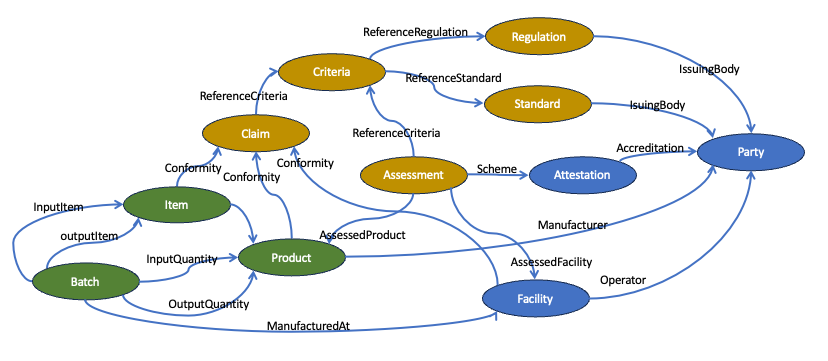

import Disclaimer from '../\_disclaimer.mdx';

<Disclaimer />

## Overview

The ESG footprint of a finished product is the aggregation of it's components and processes through the value chain. Verification of ESG claims therefore involves assessing a bundle of linked credentials (aka a "transparency graph") drawn from all or part of a value chain. Whilst each credential may be valid in it's own right, one challenge is verifying the context of related credentials. For example, a conformity assessment body that is accredited to test strength of structured steel might not be accredited to issue emissions intensity certificates. A technically valid emissions certificate linked to a technically valid accreditation certificate that has a different scope would be fraudulent. To address this problem, the UNTP defines a simple method to verify the contextual scope of linked credentials. Essentially this provides a mechanism to verify a linked graph of data at a layer above individual credential verification.

## Transparency Graphs

The UNTP core vocabulary defines the uniquely identified linked data entities such as Product, Locaiton, Facility, Party, Standard, Regulation, Criteria, Declaration, Attestation, Endorsement. These entities provide the buuilding blocks for construction of Digital Product Passports and Digital Conformity Credentials.

* A Digital Product Passport is a set of declarations (claims) against sustainability criteria defined in regulations or standards - made by a manufacturer party about a given product that is manufactured at a facility in a defined location.
* A Digital Conformity Credential is an attestation made by an endorsed confomrity assessment body - which includes one or more assesments of a list of identified products or facilities against specific criteria.

Although these two credential types have different structures, they are assembled from the same core vocabulary building blocks. This allows a supply chain transparency system to easily construct a linked data graph (a.k.a "transparency graph") from a stream of DPPs and DCCs. Claims about a product found in a DPP can be linked to assessment of the same product in DCC when both credentials have matching product and criteria identifiers. 

## JSON-LD Representation 

TBA

## SCHACL Graph verification

TBA