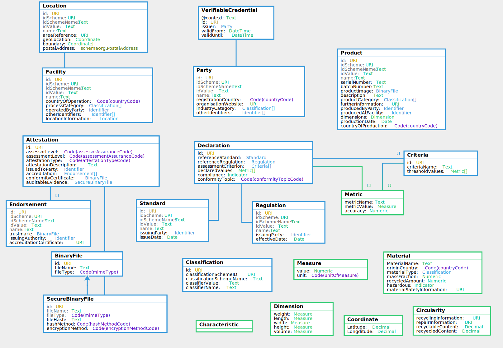

import Disclaimer from '../\_disclaimer.mdx';

<Disclaimer />

## Overview

Web **vocabularies** are a means to bring consistent understanding of **meaning** to ESG claims and assessments throughout transparent value chains based on UNTP. There are hundreds of ESG standards and regulations around the world, each with dozens or hundreds of specific conformity **criteria**. Any given value chain from raw materials to finished product is likely to include dozens of passports and conformity credentials issued against any of thousands of ESG criteria. Without a consistent means to make sense of this data, UNTP would provide a means to discover a lot of data but no easy way to make sense of it. The UNTP defines a standard and extensible topic map (taxonomy) of ESG criteria and provides a mechanism for any standards authority, or national regulator, or industry association to map their specific terminology to the UNTP vocabulary.

## UNTP Core Vocabulary

The UNTP core vocabulary defines the uniquely identified linked data entities such as Product, Locaiton, Facility, Party, Standard, Regulation, Criteria, Declaration, Attestation, Endorsement. These entities provide the buuilding blocks for construction of Digital Product Passports and Digital Conformity Credentials.

* A [Digital Product Passport](DigitalProductPassport.md) is a set of declarations (claims) against sustainability criteria defined in regulations or standards - made by a manufacturer party about a given product that is manufactured at a facility in a defined location.
* A [Digital Conformity Credential](ConformityCredential.md) is an attestation made by an endorsed confomrity assessment body - which includes one or more assesments of a list of identified products or facilities against specific criteria.

Although these two credential types have different structures, they are assembled from the same core vocabulary building blocks. This allows a supply chain transparency system to easily construct a linked data graph (a.k.a "transparency graph") from a stream of DPPs and DCCs. Claims about a product found in a DPP can be linked to assessment of the same product in DCC when both credentials have matching product and criteria identifiers.  

The latest draft untp core vocabulary is published as a JSON-LD graph at [UNTP Core Vocabulary](https://test.uncefact.org/vocabulary/untp/core/about)

## UN ESG Topic Map

TBC

## Sustainability Vocabulary Catalog

TBC

