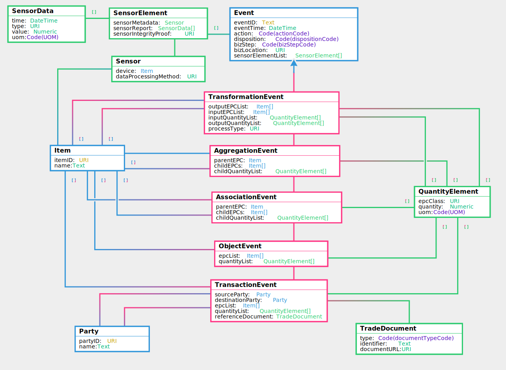

import Disclaimer from '../\_disclaimer.mdx';

<Disclaimer />

## Overview

Traceability events are very lightweights collections of identifiers that specify the “what, when, where, why and how” of the products and facilities that constitute a value chain. The UNTP is based on the [GS1 EPCIS](https://www.gs1.org/standards/epcis) standard for this purpose because it is an existing and proven mechanism for supply chain traceability. Note that UNTP supports but does not require the use of GS1 identifiers. The basic idea behind the traceability event structure is that any supply chain of any complexity can always be accurately modelled using a combination of four basic event types. An **object** event describes an action on specific product(s) such as an inspection. A **transaction** event describes the exchange of product(s) between two actors such as sale of goods between seller and buyer. An **aggregation** event describes that consolidation or de-consolidation of products such as stacking bales of cotton on a pallet for transportation. Finally, a **transformation** event describes a manufacturing process that consumes input product(s) to create new output product(s). The UNTP uses these events in a decentralised architecture as the means to traverse the linked-data "graph" that represents the entire value-chain.

## Data Model

[Traceability Events Documentation](https://jargon.sh/user/unece/traceabilityEvents/v/working/artefacts/readme/render)

## JSON Schema

